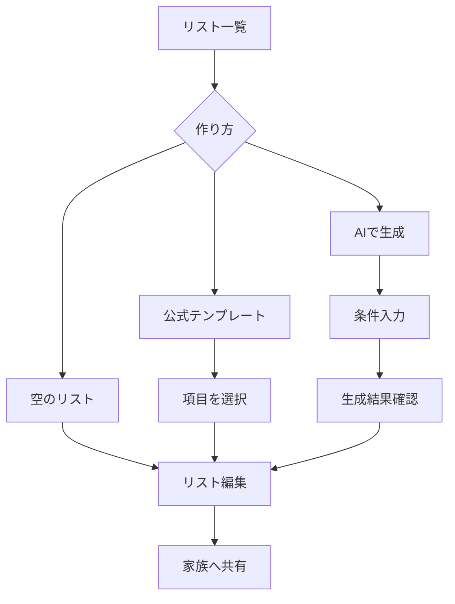
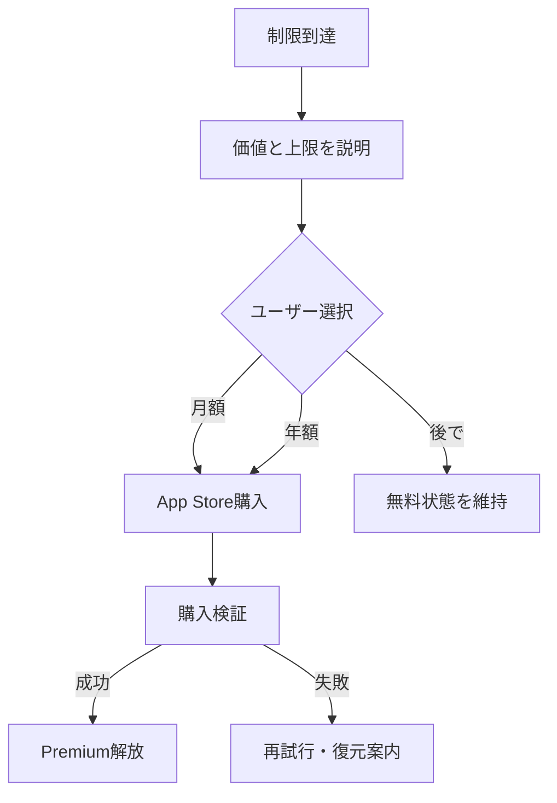
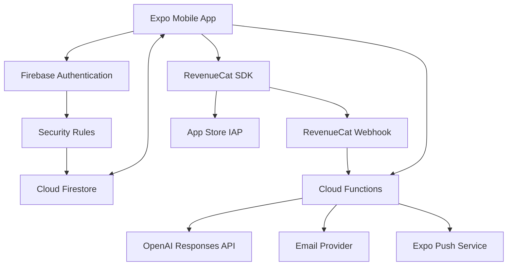

# 家族共有チェックリストアプリ 要件・事業・設計書

> 文書バージョン: 0.1  
> 作成日: 2026-07-14  
> 仮称: **Soroe（ソロエ）**  
> ステータス: MVP設計ベースライン

---

## 0. エグゼクティブサマリー

### 結論

本サービスは、単なる「共有買い物リスト」ではなく、**家族の状況に合わせて、必要な持ち物・買う物・やることをAIが生成し、家族で共有・再利用できる生活準備アプリ**として設計する。

初期ターゲットは子育て家庭。iPhone版を3〜4か月で公開し、月額480円・年額4,800円の個人課金で検証する。月間利益10万円には、安全側に見て**有料会員350人前後**、有料転換率4%ならMAU約8,750人が必要になる。

MVPの技術構成は、1人・週10〜15時間、運用費月1万円以内、リアルタイム同期、オフライン編集、将来のAndroid/Web展開を踏まえ、次を推奨する。

- アプリ: React Native + Expo + TypeScript
- データ同期: Cloud Firestore（Native/Core operations）
- 認証: Firebase Authentication + 独自メールOTP
- サーバー処理: Cloud Functions for Firebase
- AI: OpenAI Responses API + Structured Outputs
- サブスクリプション: App Store In-App Purchase + RevenueCat
- 通知: Expo Notifications / Expo Push Service
- 分析・障害監視: Firebase Analytics / Crashlytics

### プロダクトの勝ち筋

| 項目 | 方針 |
|---|---|
| 日常利用の入口 | 家族で共有する買い物リスト |
| 明確な差別化 | 家族構成・人数・用途・特徴からのAIリスト生成 |
| 継続利用 | マイテンプレートと過去リストの再利用 |
| 課金理由 | リスト数、AI生成回数、マイテンプレート数、将来の公開テンプレート |
| 成長ループ | 共有招待 → 家族利用 → テンプレート保存 → 別用途で再利用 |
| 将来の資産 | ユーザー投稿テンプレートと評価データ |

---

## 1. 合意済み前提

### 1.1 事業・開発条件

| 項目 | 決定内容 |
|---|---|
| 初期ターゲット | 子育て家庭 |
| 収益目標 | ストア手数料、AI費、インフラ費等を引いた月間利益10万円 |
| 開発期間 | iPhone版MVPを3〜4か月で公開 |
| 開発体制 | 1人、週10〜15時間 |
| 初期地域 | 日本のみ |
| 対応言語 | 日本語・英語。ただし海外公開は次フェーズ |
| 月間運用費 | 売上安定までは1万円以内 |
| 対象端末 | Phase 1 iPhone、Phase 2 Android、Phase 3 Web |
| デザイン | 3方向のデザインカンプを作成し、比較選定する |

### 1.2 課金条件

| 項目 | 決定内容 |
|---|---|
| 課金単位 | ユーザー単位 |
| 月額 | 480円前後 |
| 年額 | 4,800円を基本案とする |
| 無料リスト | 3つまで |
| 無料マイテンプレート | 1つまで |
| 無料AI生成 | アカウント生涯1回、低価格モデル |
| 有料AI生成 | 月20回、高品質モデル |
| 他ユーザーのテンプレート | 有料限定。MVPでは未提供 |
| 共有参加 | 共有リストも本人のリスト上限に算入し、上限超過には課金が必要 |

### 1.3 機能・技術条件

| 項目 | 決定内容 |
|---|---|
| リスト構造 | 買い物・持ち物・やることを共通モデルで扱う |
| 同期 | リアルタイム同期 |
| 通知 | 変更時プッシュ通知。ユーザーが通知対象を設定可能 |
| オフライン | オフライン追加・編集・チェック、復帰後の自動同期 |
| 認証 | Google、Apple、メール6桁OTP |
| 子どもアカウント | MVPでは持たない |
| 投稿テンプレート | Phase 2以降。MVPは公式テンプレートのみ |

---

## 2. プロダクト定義

### 2.1 プロダクトビジョン

**家族の「忘れた」「誰かがやると思った」「準備に時間がかかる」をなくす。**

### 2.2 提供価値

1. 思いついた物を家族がその場で追加できる。
2. 誰かが買った・準備したことが即座に分かる。
3. 初めての旅行や登山でも、AIが抜け漏れの少ない下書きを作る。
4. 一度整えたリストを、次回はテンプレートから数秒で再利用できる。
5. 将来は、似た家庭や経験者が作った実用的なテンプレートを利用できる。

### 2.3 ジョブ・トゥ・ビー・ダン

#### 日常の買い物

> 家族の誰かが必要な物に気づいたとき、忘れる前に共有リストへ追加し、買い物担当者が重複なく購入できるようにしたい。

#### 旅行・外出準備

> 旅行や外出の準備を始めるとき、家族構成と予定に合う持ち物・事前タスクを短時間で洗い出し、家族で分担したい。

#### 再利用

> 前回うまくいったリストを次回も使い、毎回ゼロから考える時間をなくしたい。

### 2.4 初期ペルソナ

#### 主ペルソナ

- 30〜40代、共働き、未就学児・小学生のいる家庭
- 家族の買い物や外出準備を、LINE・紙・標準メモに分散して管理している
- 便利さには課金するが、設定や入力の手間が多いアプリは続かない
- 「抜け漏れ防止」と「家族に説明しなくても伝わること」に価値を感じる

#### 副ペルソナ

- 子連れ旅行を年数回行う家庭
- 日帰り登山、キャンプ、ピクニックなどを始めた家庭
- 夫婦・パートナー間で日用品の買い物を分担する利用者

### 2.5 ポジショニング

| 比較軸 | 一般的なメモ・ToDo | 買い物リスト専用 | 本サービス |
|---|---:|---:|---:|
| 家族リアルタイム共有 | △ | ○ | ○ |
| 買い物への最適化 | △ | ◎ | ○ |
| 旅行・登山・行事テンプレート | △ | × | ◎ |
| 家族条件からAI生成 | × | △ | ◎ |
| マイテンプレート | △ | △ | ◎ |
| 経験者テンプレート | × | × | Phase 2で◎ |

単純な共有リストは無料競合が強い。AnyListは共有を含む基本機能を無料提供し、有料版も年額9.99ドルからである。したがって、月額480円の根拠は「共有」ではなく、**用途別AI生成と家族向けテンプレートの継続価値**で作る必要がある。[AnyList Complete](https://www.anylist.com/complete)

---

## 3. スコープ

### 3.1 MVPに含める

- Google / Apple / メールOTPによる登録・ログイン
- 初回オンボーディング
- 共通リストの作成、編集、アーカイブ、削除
- 買い物、持ち物、やることの3種類
- 項目の追加、編集、チェック、削除、並び替え
- リストの家族共有
- オーナー・編集者権限
- リアルタイム同期
- オフライン編集と自動再同期
- 変更通知とリスト別通知設定
- 公式テンプレートからのリスト作成
- リストからマイテンプレート保存
- 条件入力によるAIリスト生成
- 無料・有料プランの利用制限
- 月額・年額サブスクリプション
- 日本語・英語UI
- アカウント削除、データ削除申請
- 問い合わせ、利用規約、プライバシーポリシー
- 最小限の利用分析、障害監視

### 3.2 MVPに含めない

- ユーザー投稿テンプレートの公開・検索・評価・通報
- Android / Web版
- 子ども用アカウント・子どもプロフィール
- 写真・画像添付
- レシート読み取り、バーコード読み取り
- 位置情報による店舗通知
- カレンダー連携
- 繰り返しタスク
- 在庫管理・家計簿・価格比較
- コメント・チャット
- 音声入力の独自実装
- AIチャット
- 管理画面CMS

### 3.3 MVPから外す理由

画像、位置情報、UGC、チャットは、ストレージ費、審査、モデレーション、プライバシー、テスト範囲を急増させる。とくにUGCを扱う場合、Appleは不適切コンテンツのフィルタリング、通報、悪質ユーザーのブロック、運営連絡先等を求めているため、Phase 2で管理機能と同時に実装する。[Apple App Review Guidelines 1.2](https://developer.apple.com/app-store/review/guidelines/)

---

## 4. 利用プランと利用制限

### 4.1 プラン比較

| 機能 | Free | Premium |
|---|---:|---:|
| アクティブリスト | 合計3件 | 無制限（安全上は100件でソフト警告） |
| 共有リスト参加 | 上記3件に算入 | 無制限 |
| 1リストの項目数 | 無制限 | 無制限 |
| リアルタイム同期 | ○ | ○ |
| オフライン編集 | ○ | ○ |
| プッシュ通知 | ○ | ○ |
| 公式テンプレート | ○ | ○ |
| マイテンプレート | 1件 | 無制限 |
| AIリスト生成 | 生涯1回 | 月20回 |
| AIモデル | 低価格モデル | 高品質モデル |
| 公開テンプレート | × | Phase 2で○ |
| 料金 | 0円 | 月480円 / 年4,800円 |

### 4.2 「リスト3件」の定義

- 自分が所有するリストと、他者から共有されたリストの合計を数える。
- アクティブ状態のみ上限へ算入する。
- アーカイブ済みリストは閲覧可能だが、編集・共有・再利用にはアクティブ化が必要。
- 項目数には制限を設けない。
- 無料枠の上限は、リスト作成前と招待承認前に明示する。

国内競合のレビューでは、後から不明瞭な項目数制限が追加され、強い不満につながった事例が確認できる。上限は設定画面、作成画面、課金画面で常に同じ表現を使い、既存データを突然削除しない。[買うものかご App Store](https://apps.apple.com/jp/app/id1162049707)

### 4.3 解約・期限切れ

- データは削除しない。
- 期限切れ後に4件以上のリストがある場合、ユーザーが編集可能な3件を選ぶ。
- 未選択リストは読み取り専用とする。
- 保存済みテンプレートは保持し、1件だけ利用可能として選択させる。
- 当月のAI生成残数は期限切れ時に失効する。
- 再契約時は即座に全データを再利用可能にする。

### 4.4 課金実装上の要件

- iPhone内の機能解放にはApp StoreのIn-App Purchaseを使う。
- 購入復元を提供する。
- 月額と年額を同一サブスクリプショングループに置く。
- 課金前に価格、更新間隔、自動更新、解約方法、提供機能を明示する。
- 7日無料体験は初期には付けない。Freeプラン自体を試用導線とする。
- App Store Small Business Programへ申請し、対象期間は15%手数料を前提とする。

Appleはアプリ機能をサブスクリプションで解放する場合にIn-App Purchaseを求め、継続的な価値と料金内容の明示を要求している。[App Review Guidelines 3.1](https://developer.apple.com/app-store/review/guidelines/) Small Business Programの対象者は、有料アプリとアプリ内課金の手数料が15%になる。[Apple Small Business Program](https://developer.apple.com/app-store/small-business-program/)

---

## 5. 収益モデル

### 5.1 目標会員数

月額480円は消費税込みとし、概算では次の構造になる。

| 項目 | 1人あたり月額概算 |
|---|---:|
| ユーザー支払額 | 480円 |
| 消費税相当を除く | 約436円 |
| Apple手数料15%控除後 | 約371円 |
| AI・DB・通知等の平均変動費 | 20〜35円 |
| 1人あたり限界利益 | 約336〜351円 |

固定費を月8,000〜10,000円とした場合、月間利益10万円の必要有料会員は次のとおり。

\[
必要会員数 = \frac{100,000 + 10,000}{340} \approx 324人
\]

解約、返金、為替、AI利用の偏りを考慮し、事業KGIは**有料会員350人**とする。

### 5.2 売上・利益シナリオ

| 有料会員 | 月間総売上 | 概算利益 | 状態 |
|---:|---:|---:|---|
| 100人 | 48,000円 | 25,000〜30,000円 | PMF探索 |
| 200人 | 96,000円 | 55,000〜65,000円 | 継続改善可能 |
| 350人 | 168,000円 | 105,000〜120,000円 | 目標達成圏 |
| 500人 | 240,000円 | 155,000〜175,000円 | Android投資圏 |

※ 所得税・住民税・法人税等は含まず、サービス経費控除後の事業利益の概算。

### 5.3 必要ユーザー母数

| Free→Premium転換率 | 350人に必要なMAU |
|---:|---:|
| 2% | 17,500人 |
| 3% | 11,667人 |
| 4% | 8,750人 |
| 5% | 7,000人 |

初期目標は有料転換率4%。そのためには、無料でも買い物共有の価値を体験でき、4件目のリスト、2件目のマイテンプレート、2回目のAI生成で自然に課金理由が生じる設計にする。

### 5.4 主要KPI

| 分類 | KPI | 初期目標 |
|---|---|---:|
| 獲得 | App Store閲覧→インストール | 25%以上 |
| 活性化 | 24時間以内にリスト作成/参加＋3項目追加 | 55%以上 |
| 共有 | 7日以内の招待送信率 | 35%以上 |
| 共有 | 招待承認率 | 45%以上 |
| AI | AI生成完了→リスト保存率 | 65%以上 |
| 継続 | D7継続率 | 35%以上 |
| 継続 | D30継続率 | 20%以上 |
| 収益 | Free→Premium転換率 | 4%以上 |
| 収益 | 月次有料解約率 | 6%未満 |
| 品質 | クラッシュフリーセッション | 99.8%以上 |

### 5.5 集客方針

1. App Store Optimization: 「買い物リスト 家族 共有」「旅行 持ち物リスト」「子連れ 旅行 準備」。
2. 招待リンク: 共有相手がアプリ未導入なら、内容の一部と価値を示してインストールへ誘導。
3. 公式テンプレート記事: Web版前でもLPにテンプレート例を掲載する。
4. 子育て・登山・旅行の小規模クリエイターへ提供する。
5. AI生成結果を匿名の集計情報として改善し、テンプレート品質を上げる。

---

## 6. 機能要件

### 6.1 認証・アカウント

#### 認証方式

- Google Sign-In
- Sign in with Apple
- メールアドレス＋6桁OTP

Google等の第三者ログインを主アカウント認証に使う場合、Appleは一定のプライバシー要件を満たす同等のログイン方法も要求している。Sign in with Appleを実装する方針は審査上妥当である。[App Review Guidelines 4.8](https://developer.apple.com/app-store/review/guidelines/)

#### メールOTP

- コードは6桁数字。
- 有効期限10分。
- 再送は60秒後から。
- 1コードあたり5回失敗で無効化。
- メール、IP、端末単位でレート制限する。
- コードは平文保存せず、ソルト付きハッシュで保存する。
- 認証成功後はコードを即時無効化する。
- アカウント列挙を防ぐため、登録有無にかかわらず同じ応答を返す。

Firebase Authenticationは標準ではメールリンクとメール/パスワードを主に提供するため、6桁メールOTPはCloud Functionsとメール配信サービスで実装し、成功時にFirebase Custom Tokenを発行する。[Firebase Authentication](https://firebase.google.com/docs/auth/)

#### アカウント統合

- Googleとメールが同一メールの場合、本人確認後に認証方法をリンクする。
- Appleのメール非公開利用時は自動統合しない。
- 設定画面から認証方法を追加・解除できる。
- 最後の認証方法は解除できない。

#### アカウント削除

- アプリ内から削除を開始できる。
- 削除前に所有リストの移譲または削除を選択する。
- 7日間の取消猶予後に個人データを論理・物理削除する。
- 法令・不正対策上の保持が必要な決済記録等は分離して最小限保持する。

Appleはアカウント作成を提供するアプリに、アプリ内のアカウント削除導線を求めている。[App Review Guidelines 5.1.1(v)](https://developer.apple.com/app-store/review/guidelines/)

### 6.2 オンボーディング

1. 価値説明3画面以内。
2. ログイン方法選択。
3. 表示名と言語の確認。
4. 「買い物リストを作る」「テンプレートから作る」「家族の招待を受ける」から開始。
5. 通知許可は、共有またはリマインドの価値を説明した直後に要求する。

家族構成はアカウントプロフィールとして必須収集しない。AI生成時に必要な範囲で入力し、「次回も使う」を選択した場合だけ生成設定として保存する。

### 6.3 リスト

#### リスト種別

- `shopping`: 買い物
- `packing`: 持ち物
- `task`: やること

内部データモデルは共通とし、種別に応じて表示項目、初期カテゴリ、文言を変える。

#### リスト操作

- 新規作成
- タイトル、アイコン、色、種別変更
- 複製
- アーカイブ・復元
- 論理削除・30日以内の復元
- オーナー移譲
- 共有解除・退出
- リスト内検索
- 未完了のみ表示
- カテゴリ別表示

#### リスト項目

| フィールド | 必須 | 用途 |
|---|---:|---|
| タイトル | ○ | 全種別 |
| 完了状態 | ○ | 全種別 |
| 数量 |  | 買い物・持ち物 |
| 単位 |  | 買い物・持ち物 |
| カテゴリ |  | 全種別 |
| メモ |  | 全種別 |
| 担当者 |  | 共有ユーザー |
| 期限 |  | やること |
| 並び順 | ○ | 手動並び替え |
| 作成者・完了者 | ○ | 共有時の履歴 |

#### 高速入力

- 画面下部に常設の入力欄を置く。
- Enterで追加し、入力欄を閉じない。
- 過去入力と公式語彙から候補を表示する。
- 「牛乳 2本」のような入力から数量・単位を補助抽出するが、誤りがあっても即時追加を妨げない。
- チェック済み項目は下部へ移動し、まとめて非表示・削除できる。

### 6.4 共有

#### 招待方式

- OS共有シートで招待リンクを送る。
- メールアドレスで招待する。
- 対面用QRコードを表示する。

#### 権限

| 権限 | 操作 |
|---|---|
| オーナー | 全編集、共有管理、削除、所有権移譲 |
| 編集者 | 項目操作、リスト基本情報編集、退出 |

閲覧者権限はMVPでは設けない。必要性が確認された場合に追加する。

#### 無料枠上限時

- 招待内容のプレビューは表示する。
- 参加すると4件目になる場合、どれかをアーカイブするかPremiumへ移行する。
- 課金しない限り、4件目を編集可能な状態で参加できない。
- 招待リンク自体は7日間有効とし、再発行可能にする。

### 6.5 リアルタイム同期・オフライン

- リストと項目はFirestoreのリアルタイムリスナーで購読する。
- 項目は1件1ドキュメントとし、別項目の同時操作が衝突しにくい構造にする。
- モバイルのローカル永続キャッシュを利用する。
- オフライン中の変更は画面へ即時反映し、「未同期」表示を付ける。
- 復帰後、自動送信して同期済み表示へ変える。
- 同一項目の同一フィールドが競合した場合は最終更新優先とする。
- 削除は即時物理削除せず、`deletedAt`を使う。
- ドキュメント全体ではなく、変更フィールドだけを更新する。

Cloud Firestoreはモバイルでオフライン読み書きと復帰後の同期を提供し、同一ドキュメントの複数変更はLast Write Winsとなる。[Firestore Offline](https://firebase.google.com/docs/firestore/manage-data/enable-offline)

### 6.6 通知

#### 通知対象

- リストへ招待された
- 招待が承認された
- 項目が追加された
- 項目が更新・削除された
- 項目が完了した
- 担当者に設定された

#### 通知設計

- 招待と担当者設定は即時通知。
- 項目変更は60〜120秒でまとめ、「3件追加されました」のように集約する。
- 完了通知は初期値OFF。
- 自分の操作は自分へ通知しない。
- アプリ全体設定とリスト別設定を持つ。
- 通知をタップすると対象リスト・項目へ遷移する。

### 6.7 公式テンプレート

#### 初期カテゴリ

| カテゴリ | 初期テンプレート例 |
|---|---|
| 買い物 | 1週間分の食材、日用品補充、BBQ、ホームパーティー |
| 子連れ旅行 | 1泊2日、2泊3日、帰省、温泉、テーマパーク |
| 外出 | 公園、ピクニック、プール、海水浴、動物園 |
| アウトドア | 日帰り登山、低山ハイキング、キャンプ、雨天登山 |
| 学校・園 | 遠足、運動会、授業参観、入学準備 |
| 家庭 | 防災用品、引っ越し、年末掃除、入院準備 |

初期は20〜30テンプレートをJSON/Firestore seedで提供し、管理画面は作らない。変更はリポジトリでレビューし、デプロイ処理で反映する。

#### テンプレート操作

- 詳細確認
- 不要項目を外してリスト作成
- 人数に応じた数量補正
- 作成後は通常リストとして自由編集
- リストからマイテンプレート保存

安全に関わる登山・防災テンプレートには、「状況や専門機関の最新情報を確認すること」「安全を保証するものではないこと」を表示する。

### 6.8 マイテンプレート

- 現在のリストから保存する。
- タイトル、説明、カテゴリ、項目、初期チェック状態を保持する。
- 共有関係、担当者、完了履歴は保持しない。
- 保存後は元リストと独立して編集する。
- Freeは1件、Premiumは無制限。

### 6.9 AIリスト生成

#### 入力ステップ

1. 用途: 旅行、買い物、登山、学校行事、自由入力。
2. 人数: 大人、子どもの人数。
3. 子どもの年齢帯: 乳児、未就学、小学生、中高生。
4. 期間・時期: 日帰り、泊数、季節。
5. 特徴: 車移動、雨予報、温泉、食事付き、初心者等。
6. 自由記述: 最大500文字。

#### 出力

- リストタイトル
- リスト種別
- カテゴリ
- 項目名
- 数量・単位
- 短い理由または注意事項
- 「必須」「あると便利」の区分

生成後は必ずプレビューを表示し、ユーザーが項目を外してから保存する。AIが直接共有リストを確定変更しない。

#### API設計

- モバイルからOpenAI APIを直接呼ばない。
- Cloud Functionsで認証、権限、月次利用回数、レート制限を検証する。
- Responses APIを利用する。
- Structured OutputsでJSON Schemaへ厳密に適合させる。
- サーバー側でもZodで再検証する。
- Free/Premiumのモデル名は設定値にし、アプリ更新なしで変更可能にする。
- 2026-07時点の初期案はFreeにGPT-5.6 Luna、PremiumにGPT-5.6 Terra。
- 1回の最大出力項目数は80件。
- タイムアウト、拒否、形式不正時は1回だけ自動再試行する。

OpenAIは新規プロジェクトでResponses APIを利用でき、Structured OutputsによりJSON Schemaへ準拠した出力を得られる。[Responses API](https://developers.openai.com/api/reference/responses/overview) [Structured Outputs](https://developers.openai.com/api/docs/guides/structured-outputs)

#### AI利用制限

- Free: アカウント単位で生涯1回。
- Premium: 日本時間の暦月で20回。
- 未使用回数は繰り越さない。
- 生成失敗や安全拒否は回数を戻す。
- 同一ユーザーの同時生成は1件まで。
- 利用回数はクライアント申告を信用せず、サーバーで原子的に更新する。

#### 品質管理

- 旅行、登山、買い物、学校行事について50ケース以上の評価セットを作る。
- 評価軸: 必須項目網羅、危険な提案なし、重複なし、人数・季節反映、80件以内。
- プロンプトまたはモデル変更時に回帰評価する。
- ユーザーは各生成結果を「役に立った / 足りなかった」で評価できる。

### 6.10 サブスクリプション

- Paywallは制限到達時と設定画面から表示する。
- 価格だけでなく、具体的に増える利用量を表示する。
- RevenueCatのEntitlementを正とし、Firestoreに同期したキャッシュをサーバー判定に使う。
- 購入・更新・解約・返金はWebhookで反映する。
- 購入復元を提供する。
- 決済障害中は直近の有効状態を短期間猶予する。

RevenueCatはExpo/React Nativeをサポートし、月間追跡売上2,500ドルまでは無料、その後は追跡売上の1%という料金体系である。[RevenueCat Pricing](https://www.revenuecat.com/pricing/)

---

## 7. 画面一覧・主要フロー

### 7.1 画面一覧

| ID | 画面 |
|---|---|
| AUTH-01 | ウェルカム |
| AUTH-02 | ログイン方法選択 |
| AUTH-03 | メールOTP入力 |
| HOME-01 | リスト一覧 |
| LIST-01 | リスト詳細 |
| LIST-02 | リスト設定 |
| SHARE-01 | 共有メンバー・招待 |
| TMPL-01 | 公式テンプレート一覧 |
| TMPL-02 | テンプレート詳細・項目選択 |
| MYTM-01 | マイテンプレート一覧 |
| AI-01 | AI生成: 用途 |
| AI-02 | AI生成: 家族・条件 |
| AI-03 | AI生成: 特徴・自由入力 |
| AI-04 | AI生成中 |
| AI-05 | 生成結果プレビュー |
| PAY-01 | Premium説明・購入 |
| SET-01 | アカウント設定 |
| SET-02 | 通知設定 |
| SET-03 | 認証方法管理 |
| SET-04 | データ・アカウント削除 |

### 7.2 リスト作成フロー



### 7.3 課金フロー



---

## 8. 非機能要件

### 8.1 性能

| 指標 | 要件 |
|---|---|
| コールド起動 | P75 2.5秒以内を目標 |
| リスト初期表示 | キャッシュ有りで1秒以内 |
| オンライン同期 | 通常時1秒以内に他端末へ反映 |
| 項目追加操作 | 100ms以内にローカル反映 |
| AI生成 | P95 15秒以内、30秒でタイムアウト |
| 1リスト推奨上限 | 500項目。超過時は警告 |

### 8.2 可用性・復旧

- クラウド障害時もキャッシュ済みリストを操作可能にする。
- バックエンド処理は冪等性キーを持つ。
- RevenueCat WebhookはイベントIDで重複排除する。
- AI生成はリクエストIDで二重課金・二重カウントを防ぐ。
- Firestoreの削除保護、日次エクスポートを成長後に有効化する。

### 8.3 セキュリティ

- APIキーと管理資格情報をアプリへ埋め込まない。
- Firebase App Checkを有効化する。
- Firestore Security Rulesでリストメンバー以外の読み書きを拒否する。
- サブスクリプション、AI回数、招待受諾はサーバー側で検証する。
- 招待トークンは128bit以上の乱数とし、DBにはハッシュを保存する。
- OTP、招待、AI APIにレート制限を設ける。
- ログへメール、自由入力、リスト本文を原則出力しない。
- 依存関係の脆弱性スキャンをCIで行う。

### 8.4 プライバシー

- 収集データと利用目的をプライバシーポリシーへ明記する。
- AIへ送る情報を生成前に説明する。
- 氏名や住所などの入力を求めない。
- AI改善のための入力保存は初期値OFFとする。
- 分析イベントへリスト本文・自由記述を含めない。
- 保存地域、外部送信先、削除方法を明示する。

個人情報保護法の利用目的、安全管理、第三者提供等を踏まえ、公開前に日本向けプライバシーポリシーを整備する。[個人情報保護委員会 ガイドライン](https://www.ppc.go.jp/personalinfo/legal/guidelines_tsusoku/)

### 8.5 アクセシビリティ

- Dynamic Typeへ対応する。
- タップ領域44×44pt以上。
- 色だけで状態を伝えない。
- VoiceOverラベルを付ける。
- WCAG 2.2 AA相当のコントラストを目標とする。
- チェック操作には視覚・触覚フィードバックを付ける。
- Reduce Motion設定を尊重する。

### 8.6 多言語

- UI文字列をコードへ直書きしない。
- 日本語と英語でレイアウト崩れをテストする。
- AI出力言語はユーザー設定に合わせる。
- 公式テンプレートは言語別の表示文言を持ち、IDは共通化する。
- 日付、数値、単位、複数形はロケール対応する。

---

## 9. 技術スタック

> **2026-07-19 技術選定注記:** 本章の構成は初期候補である。バージョン固定、状態管理、リスト描画、書込の信頼境界、Deep Linkを再評価した結果、実装時の正本は `soroe-technology-stack-evaluation.md` とする。`STACK-GATE-01` の実機PoC合格前に採用確定しない。

### 9.1 推奨構成

| レイヤー | 採用技術 | 選定理由 |
|---|---|---|
| Mobile | React Native + Expo SDK 57系 + TypeScript | iOS先行でもAndroid/Webへ展開しやすい。既存のReact知識を活かせる |
| Navigation | Expo Router | ファイルベース、Deep Link、Web展開との整合 |
| UI state | Zustand | 小さく、リスト編集UIの一時状態に適する |
| Form | React Hook Form + Zod | 型安全な入力と検証 |
| Lists | FlashList | 長いチェックリストの描画効率 |
| i18n | i18next + react-i18next | 日英切替と将来拡張 |
| Native Firebase | React Native Firebase | Firestoreのネイティブオフライン永続化、Auth、Crashlytics |
| Database | Cloud Firestore Standard / Core | リアルタイムとオフラインを最小工数で両立 |
| Backend | Cloud Functions for Firebase 2nd gen / TypeScript | AI、OTP、通知、課金Webhookをサーバー化 |
| Auth | Firebase Authentication + Custom Token | Google/AppleとFirestore Rulesを統合 |
| Email | Resend等のトランザクションメール | OTP配信。送達率と費用で選定 |
| AI | OpenAI Responses API | Structured OutputsでリストJSONを安定生成 |
| Subscription | RevenueCat + StoreKit | IAP状態・復元・将来のGoogle Play/Webを統一 |
| Push | Expo Notifications / Push Service | iOS/Androidの差分を抑える |
| Analytics | Firebase Analytics | 無料で主要ファネルを計測 |
| Crash | Firebase Crashlytics | ネイティブクラッシュを収集 |
| CI/CD | GitHub Actions + EAS Build/Submit | 1人開発で署名・配布を省力化 |
| Test | Vitest/Jest, RNTL, Maestro, Firebase Emulator | 単体、画面、E2E、Rulesを分離して検証 |

Expoは一つのTypeScriptプロジェクトからiOS、Android、Webを構築できる。React Native FirebaseはExpo Goでは使えないため、最初からExpo Development Buildを使う。[Expo](https://docs.expo.dev/) [Expo + Firebase](https://docs.expo.dev/guides/using-firebase/) [React Native Firebase Firestore](https://rnfirebase.io/firestore/usage)

### 9.2 Laravel/AWSを採用しない理由

Laravel + PostgreSQL + AWSでも実現できるが、MVPからオフライン同期、競合解決、リアルタイム購読、プッシュ通知、モバイル認証を個別に設計・運用する必要がある。1人・週10〜15時間・3〜4か月・月1万円以内という条件では、開発速度と運用負荷でFirebase構成が優位。

Laravelは、UGC検索、複雑な集計、管理画面、外部連携が増え、Firestoreのデータモデルが明確な制約になった時点で再評価する。

### 9.3 リポジトリ構成

```text
root/
├─ apps/
│  └─ mobile/             # Expo / React Native
├─ functions/             # Cloud Functions
├─ packages/
│  ├─ domain/             # Entity, value object, use case interface
│  ├─ schemas/            # Zod / JSON Schema
│  ├─ i18n/               # ja/en resources
│  └─ design-tokens/      # color, spacing, typography
├─ firebase/
│  ├─ firestore.rules
│  ├─ firestore.indexes.json
│  └─ seed/               # official templates
├─ tests/
│  ├─ e2e/
│  └─ ai-evals/
└─ docs/
```

### 9.4 設計原則

- UIからFirebase SDKを直接呼ばず、Repositoryを介す。
- FirestoreのDocument型をドメイン型として使わない。
- サーバー状態をZustandへ複製しない。
- AIモデル名、上限、Paywall文言は設定で変更可能にする。
- 機能単位のVertical Sliceで配置する。
- 将来のバックエンド移行に備え、認証・課金・AI・データアクセスに境界を置く。

---

## 10. 全体アーキテクチャ



### 10.1 信頼境界

| 処理 | クライアント | サーバー |
|---|---:|---:|
| リスト・項目の通常CRUD | ○（Rulesで制御） |  |
| 共有招待発行・受諾 | リクエスト | ○ |
| Premium判定 | 表示用キャッシュ | ○ |
| AI回数消費・モデル選択 | リクエスト | ○ |
| OTP検証 | 入力 | ○ |
| 通知送信 |  | ○ |
| RevenueCat Webhook検証 |  | ○ |

---

## 11. データ設計

### 11.1 コレクション

```text
users/{uid}
users/{uid}/devices/{deviceId}
users/{uid}/myTemplates/{templateId}
users/{uid}/generationProfiles/{profileId}

lists/{listId}
lists/{listId}/members/{uid}
lists/{listId}/items/{itemId}

officialTemplates/{templateId}
officialTemplates/{templateId}/items/{itemId}

invites/{inviteId}
entitlements/{uid}
aiUsage/{uid_yyyyMM}
aiRequests/{requestId}
otpChallenges/{challengeId}
notificationJobs/{jobId}
```

### 11.2 主要ドキュメント

#### `lists/{listId}`

```ts
type ListDocument = {
  ownerId: string;
  title: string;
  type: 'shopping' | 'packing' | 'task';
  icon: string;
  colorToken: string;
  status: 'active' | 'archived' | 'deleted';
  sortMode: 'manual' | 'category' | 'createdAt';
  memberCount: number;
  itemCount: number;
  createdAt: Timestamp;
  updatedAt: Timestamp;
  deletedAt: Timestamp | null;
};
```

#### `lists/{listId}/items/{itemId}`

```ts
type ListItemDocument = {
  title: string;
  completed: boolean;
  quantity: number | null;
  unit: string | null;
  category: string | null;
  note: string | null;
  assigneeId: string | null;
  dueAt: Timestamp | null;
  sortKey: string;
  createdBy: string;
  completedBy: string | null;
  completedAt: Timestamp | null;
  createdAt: Timestamp;
  updatedAt: Timestamp;
  deletedAt: Timestamp | null;
};
```

### 11.3 インデックス方針

- アクティブリスト: `members/{uid}`のCollection Groupではなく、ユーザー側に一覧用参照を非正規化する案をPoCで比較する。
- 項目: `deletedAt + completed + sortKey`。
- 公式テンプレート: `locale + category + published + priority`。
- 不要な単一フィールドインデックスを除外し、書き込み費と保存量を抑える。

### 11.4 整合性

- メンバー追加とユーザー側参照作成はCloud Functionで冪等に行う。
- `memberCount`、`itemCount`は表示高速化用であり、権限判断には使わない。
- 所有者は必ずmember role=`owner`を持つ。
- 最後のownerは退出できない。
- 物理削除はスケジュール処理で30日後に実行する。

---

## 12. API・サーバー処理

### 12.1 Callable/HTTP Functions

| Function | 用途 |
|---|---|
| `requestEmailOtp` | OTP発行・メール送信 |
| `verifyEmailOtp` | OTP検証・Custom Token発行 |
| `createInvite` | 招待トークン発行 |
| `acceptInvite` | 上限・権限確認後に参加 |
| `generateList` | AI回数消費・生成・検証 |
| `restoreAiCredit` | 失敗時の回数補償（内部） |
| `revenueCatWebhook` | Entitlement同期 |
| `deleteAccount` | 削除ワークフロー開始 |
| `sendNotificationBatch` | 集約通知送信 |

### 12.2 冪等性

- 書き込み系APIは`requestId`を必須にする。
- 同一`uid + requestId`は同じ結果を返す。
- AI生成は「回数予約→生成→確定」の状態機械で扱う。
- Webhookは外部イベントIDを保存して重複処理しない。

---

## 13. デザイン設計

### 13.1 デザイン原則

1. **追加が最短**: リスト詳細では1タップ＋入力で項目を追加できる。
2. **情報密度を保つ**: 角丸や余白を増やしすぎず、1画面で8〜10項目を見せる。
3. **家族向けだが幼くしない**: 子ども向けイラストに寄せず、大人が日常で使える。
4. **共有状態が伝わる**: 誰が追加・完了したかを必要な場面だけ表示する。
5. **AIを魔法に見せすぎない**: 生成結果は下書きとして確認・修正できる。
6. **課金制限を突然出さない**: 残数と制限を事前に見せる。

### 13.2 情報設計

下部タブは4つに限定する。

1. リスト
2. テンプレート
3. AI生成
4. 設定

「作成」はリスト画面の主要ボタンから開始し、空、テンプレート、AIの3方式を選ぶ。

### 13.3 デザインカンプ3案

同じ画面・同じ情報量で3案を作成し、見た目だけでなく操作速度を比較する。

#### A. Warm Utility

- 方向性: 温かい、安心、生活になじむ、子どもっぽすぎない。
- 背景: ウォームホワイト。
- 主色: セージグリーン。
- 補助色: テラコッタ、マスタード。
- 形状: 角丸は中程度、リスト行はコンパクト。
- アイコン: 細めの線画＋一部塗り。
- 向く訴求: 子育て家庭、家族の安心感。

暫定トークン:

| Token | Value |
|---|---|
| Primary | `#4F7A67` |
| Primary Soft | `#E7F0EB` |
| Accent | `#D9825B` |
| Background | `#FBF8F2` |
| Text | `#26332D` |
| Radius | 12 |

#### B. Quiet Focus

- 方向性: Notion、Thingsに近い、静かで高密度な生産性ツール。
- 背景: 白〜淡いグレー。
- 主色: ディープブルー。
- 補助色: スレート、ミント。
- 形状: 小さめの角丸、区切り線中心。
- アイコン: SF Symbolsに近い単色線画。
- 向く訴求: 入力速度、視認性、長期利用。

暫定トークン:

| Token | Value |
|---|---|
| Primary | `#315C9B` |
| Primary Soft | `#EAF0F8` |
| Accent | `#3C8D7A` |
| Background | `#F7F8FA` |
| Text | `#1E2630` |
| Radius | 8 |

#### C. Friendly Tiles

- 方向性: 明るい、発見が楽しい、テンプレートを選びたくなる。
- 背景: 明るいアイボリー。
- 主色: コーラル。
- 補助色: ティール、イエロー、ブルー。
- 形状: カードとタイルを多用。
- アイコン: シンプルなカラーイラスト。
- 向く訴求: テンプレート探索、初回体験、App Store映え。

暫定トークン:

| Token | Value |
|---|---|
| Primary | `#EF6A5B` |
| Primary Soft | `#FDEAE6` |
| Accent | `#2D9C95` |
| Background | `#FFF9EF` |
| Text | `#34302D` |
| Radius | 16 |

### 13.4 カンプ対象画面

各案で次の4画面を作る。

1. リスト一覧: 日常の印象、残数、共有状態。
2. 買い物リスト詳細: 情報密度、追加、チェックの速さ。
3. AI生成条件入力: 複雑な入力を迷わず進められるか。
4. テンプレート一覧: 発見性とPremium価値。

### 13.5 選定方法

5〜8名の対象ユーザーへ、同一タスクで比較テストする。

| 評価軸 | 重み |
|---|---:|
| 項目追加・チェックの速さ | 25% |
| 読みやすさ・情報密度 | 20% |
| 家族で使いたい印象 | 20% |
| AI・課金への信頼感 | 15% |
| App Storeで選びたくなる | 10% |
| アクセシビリティ | 10% |

単純な多数決ではなく、タスク時間、誤操作、5段階評価、自由コメントから決める。A/B/Cの良い部分を早期に混ぜず、まず一つの方向を選んでから改善する。

---

## 14. 分析イベント

| Event | 主な属性 |
|---|---|
| `sign_up_completed` | method, locale |
| `list_created` | type, source(empty/template/ai) |
| `item_added` | list_type, online_state |
| `invite_sent` | channel |
| `invite_accepted` | inviter_plan, invitee_plan |
| `template_viewed` | template_id, category |
| `template_instantiated` | template_id, selected_item_count |
| `ai_generation_started` | use_case, plan |
| `ai_generation_completed` | item_count, latency_bucket |
| `ai_generation_saved` | kept_ratio |
| `paywall_viewed` | trigger |
| `purchase_completed` | product_id |
| `limit_reached` | limit_type |

リスト名、項目名、自由入力、メールアドレス等は分析属性へ送らない。

---

## 15. テスト戦略

### 15.1 自動テスト

- Domain: 上限、権限、解約後状態、AI回数を単体テスト。
- Repository: Firebase EmulatorでCRUDとオフライン後同期を検証。
- Security Rules: 非メンバー、編集者、owner、削除済みユーザーのケースを網羅。
- Functions: OTP、招待、Webhook、AI冪等性を統合テスト。
- UI: React Native Testing Libraryで主要画面。
- E2E: Maestroで登録、共有、オフライン、課金復元の主要経路。
- AI: 固定評価セットでStructured Outputと品質を回帰評価。

### 15.2 最重要E2Eシナリオ

1. Aがリストを作成し、Bへ招待、Bが追加、Aへリアルタイム反映。
2. Bがオフラインで項目追加・チェックし、復帰後にAへ反映。
3. Freeが3件保有中に4件目へ参加しようとし、制限が正しく表示される。
4. Premium購入後に制限が解除され、再起動後も維持される。
5. 解約後に3件を選択し、それ以外が読み取り専用になる。
6. AI生成失敗時に利用回数が戻る。
7. 同一Apple/Google/メール認証のアカウントリンクが重複を作らない。

### 15.3 実機テスト

- iPhoneの小画面・大画面。
- 日本語・英語。
- Wi-Fiから機内モード、復帰。
- 2端末同時編集。
- 通知拒否・許可・後から変更。
- Dynamic Type最大付近、VoiceOver。
- TestFlight課金Sandbox。

---

## 16. 開発ロードマップ

### 16.1 14週間案

| 週 | 成果 |
|---:|---|
| 1 | 要件確定、計測設計、Firebase/Expo PoC |
| 2 | 3案のデザインカンプ、ユーザーテスト、方向選定 |
| 3 | デザイントークン、画面設計、リポジトリ基盤 |
| 4 | Google/Apple/メールOTP認証 |
| 5 | リスト・項目CRUD、ローカル即時反映 |
| 6 | Firestore同期、オフライン、競合・削除設計 |
| 7 | 招待、共有、権限、Deep Link |
| 8 | 通知、通知設定、集約処理 |
| 9 | 公式・マイテンプレート |
| 10 | AI生成、Structured Outputs、利用回数 |
| 11 | RevenueCat、月額/年額、上限・解約状態 |
| 12 | 日英対応、規約、削除、アクセシビリティ |
| 13 | E2E、実機、負荷・セキュリティ、TestFlight |
| 14 | ベータ改善、App Store申請 |

週10時間なら140時間、週15時間なら210時間。すべてを高完成度で実装するには厳しいため、週次で機能完成を優先し、公式テンプレート数、アニメーション、細かなカスタマイズを調整弁にする。

### 16.2 フェーズ展開

#### Phase 1: iPhone MVP

- 本書のMVP。
- 目標: 100有料会員、D30 20%、クラッシュフリー99.8%。

#### Phase 2: Android + ユーザーテンプレート

- Google Play課金。
- 投稿、公開申請、運営承認。
- 検索、カテゴリ、評価、保存。
- 通報、ブロック、管理画面、公開停止。
- Premiumのみ公開テンプレートから作成可能。

#### Phase 3: Web

- PCでテンプレートや長いリストを編集。
- Web課金を追加し、RevenueCat Entitlementを統一。
- SEO向け公開テンプレートLP。ただし内容全体の利用はPremium。

---

## 17. Phase 2 ユーザー投稿テンプレート要件

### 17.1 公開フロー

1. 自分のマイテンプレートから公開申請。
2. タイトル、説明、カテゴリ、対象、注意事項、言語を入力。
3. 個人情報・不適切表現の自動検査。
4. 運営者が承認・差し戻し・却下。
5. 公開後も編集は再審査。

### 17.2 権利・安全

- 投稿者は公開・配信に必要な非独占ライセンスを許諾する。
- 第三者著作物、個人情報、広告、危険行為を禁止する。
- 運営は公開停止・削除できる。
- ユーザーは通報・投稿者ブロックができる。
- 医療、防災、登山等はカテゴリ別免責と注意表示を行う。

### 17.3 ランキング

単純な保存数だけでなく、次を組み合わせる。

- 保存後の利用率
- リスト作成後の項目保持率
- 低評価・通報率
- 更新の新しさ
- 同一投稿者の露出上限

---

## 18. リスクと対策

| リスク | 影響 | 対策 |
|---|---|---|
| 月480円が高く見える | 転換率低下 | AI生成と用途別テンプレートをPaywallで具体表示。年額4,800円を基準表示 |
| 個人課金で共有相手にも課金が必要 | 招待承認率低下 | 3件までは完全共有。4件目はプレビューとアーカイブ選択を提供。KPI悪化時は家族課金をA/B検証 |
| Freeリスト3件が厳しい | 初期定着低下 | 項目数は無制限。アーカイブ閲覧を許可。上限を事前表示 |
| AIが不十分・危険 | 信頼低下 | 下書き扱い、Structured Outputs、評価セット、注意表示 |
| リアルタイム購読費増 | 粗利低下 | 必要なリストだけ購読、画面離脱時解除、読み取り量を計測 |
| オフライン競合 | データ不整合 | 項目別ドキュメント、部分更新、soft delete、競合テスト |
| OTP悪用 | メール費・不正登録 | レート制限、App Check、ハッシュ、短期失効 |
| 3〜4か月で過大 | 公開遅延 | UGC・画像・位置情報を除外。14週時点で公式テンプレート数を調整 |
| UGCの運営負荷 | Phase 2の固定費増 | 事前承認、通報、公開停止、ガイドライン、管理画面を同時導入 |

### 18.1 最重要の事業仮説

現在の個人課金・共有参加上限制は、収益には強いが招待成長を阻害する可能性がある。仕様は合意どおり実装するが、次の条件で家族プランを再検討する。

- 招待承認率が30%未満。
- Freeの上限到達後7日以内課金率が3%未満。
- 解約理由の20%以上が「家族全員分だと高い」。

代替実験案は、月680〜780円で同一世帯4人までのファミリープラン。

---

## 19. リリース判定

以下を満たした場合にApp Storeへ申請する。

- P0/P1不具合が0件。
- 主要E2Eシナリオが全件成功。
- 2端末・オフライン同期テスト成功。
- 課金、解約、復元、期限切れをSandboxで確認。
- Apple、Google、メールOTP認証を確認。
- アプリ内アカウント削除が完了する。
- 利用規約、プライバシーポリシー、サポートURL公開。
- AI出力50ケースで重大な危険提案0件。
- VoiceOverとDynamic Typeの主要経路を確認。
- App Review用デモアカウントまたは十分な審査手順を用意。
- App Storeの価格・機能説明とアプリ内表示が一致。

---

## 20. 次の作業

### 直近の順序

1. 仮称とコンセプト文言を確定する。
2. 主要4画面についてA/B/Cのデザインカンプを作る。
3. 5〜8名で比較テストし、一つの方向を選ぶ。
4. Expo + React Native Firebaseで、2端末・オフライン同期PoCを作る。
5. Firestore Security Rulesとリスト上限のドメイン仕様を確定する。
6. MVPバックログへ分解し、14週間のスプリント計画に落とす。

### デザインカンプ前に固定する文言

- コンセプト: **家族の準備を、いっしょに、かんたんに。**
- AI訴求: **家族と予定を選ぶだけ。必要なものをAIが下書きします。**
- Premium訴求: **何度でも使える、わが家の準備リスト。**

---

## 参考資料

- [Apple App Review Guidelines](https://developer.apple.com/app-store/review/guidelines/)
- [Apple App Store Small Business Program](https://developer.apple.com/app-store/small-business-program/)
- [AnyList Complete](https://www.anylist.com/complete)
- [Cloud Firestore Offline](https://firebase.google.com/docs/firestore/manage-data/enable-offline)
- [Cloud Firestore Pricing](https://firebase.google.com/docs/firestore/pricing)
- [Expo Documentation](https://docs.expo.dev/)
- [Expo Firebase Guide](https://docs.expo.dev/guides/using-firebase/)
- [React Native Firebase Firestore](https://rnfirebase.io/firestore/usage)
- [RevenueCat Pricing](https://www.revenuecat.com/pricing/)
- [OpenAI Responses API](https://developers.openai.com/api/reference/responses/overview)
- [OpenAI Structured Outputs](https://developers.openai.com/api/docs/guides/structured-outputs)
- [OpenAI API Pricing](https://openai.com/api/pricing/)
- [個人情報保護委員会 ガイドライン](https://www.ppc.go.jp/personalinfo/legal/guidelines_tsusoku/)
