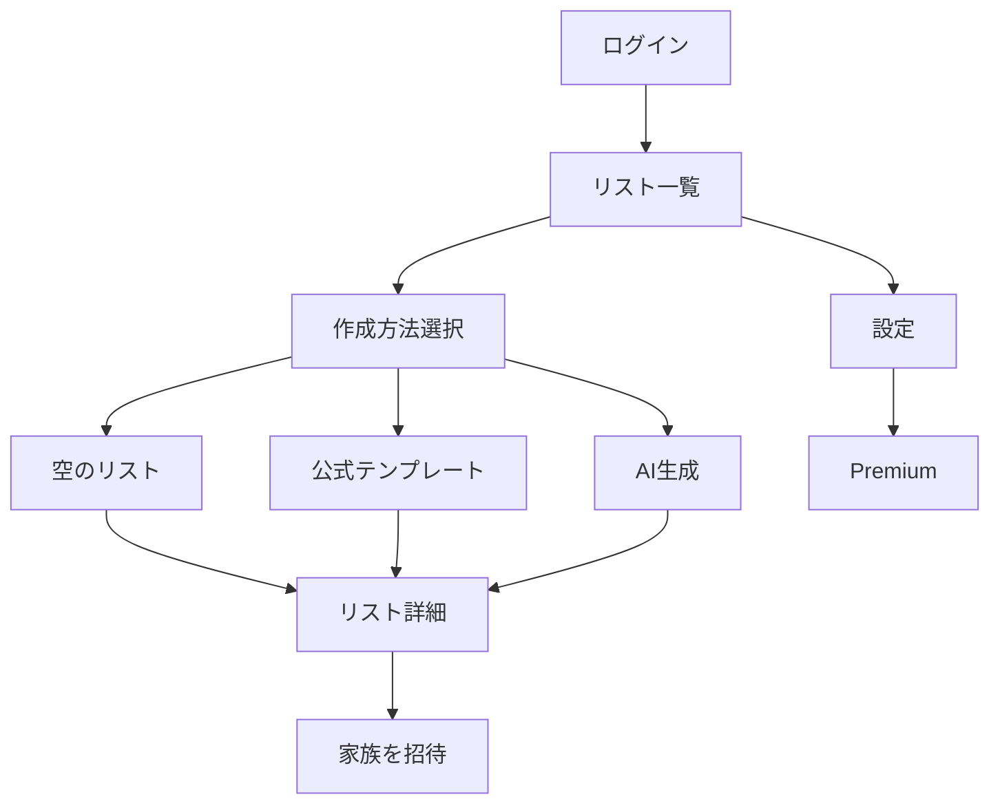

# Soroe MVP 機能仕様書

| 項目 | 内容 |
|---|---|
| 文書バージョン | 1.0 |
| 対象 | iPhone版 MVP |
| 対応言語 | 日本語・英語 |
| 前提資料 | Design.pdf / DesignSystem.pdf / 家族共有チェックリストアプリ 要件・事業・設計書 |
| 対象外 | Android・Web・ユーザー公開テンプレート・コメント・子ども用プロフィール |

## 1. 目的

本書は、Soroeの画面設計を実装・テスト可能な機能仕様へ変換する。各機能について表示条件、操作、保存データ、権限、プラン制限、通知、例外、計測イベントを定義する。

SoroeのMVPにおけるコア体験は、ユーザーがリストを作り、家族を招待し、複数人で項目を追加・完了できることである。AI生成とテンプレートは、準備の手間を減らしPremiumへの転換理由を作る機能と位置づける。

## 2. 共通ルール

### 2.1 ユーザー状態

| 状態 | 定義 | 利用可能範囲 |
|---|---|---|
| 未認証 | ログイン前 | ログイン、招待プレビュー |
| Free | 有効なPremium権利なし | アクティブリスト3件、マイテンプレート1件、AI生成は生涯1回 |
| Premium | 月額または年額が有効 | リスト・マイテンプレート無制限、AI生成は月20回 |
| 猶予中 | 決済更新確認中 | 短期間は直前のPremium機能を維持 |
| 期限切れ | Premium失効 | データ保持、規定数を超えたデータは読み取り専用 |
| 削除猶予中 | 削除申請後7日以内 | ログイン時に取消またはログアウトのみ案内 |

### 2.2 リスト上限の数え方

- Freeは、所有リストと参加中の共有リストを合わせてアクティブ3件までとする。
- アーカイブ済み・削除済みリストは上限に含めない。
- 項目数と共有人数はMVPでは制限しない。
- 4件目の作成、複製、テンプレート利用、AI結果保存、招待承認、アーカイブ解除の直前に上限判定する。
- 上限到達時は既存データを削除せず、「リストをアーカイブ」「Premiumを見る」「キャンセル」を提示する。
- Premium失効時に4件以上ある場合、編集可能な3件をユーザーが選択する。それ以外は読み取り専用とする。

### 2.3 権限

| 操作 | オーナー | 編集者 |
|---|:---:|:---:|
| リスト・項目の閲覧 | ○ | ○ |
| 項目の追加・編集・完了・削除・並べ替え | ○ | ○ |
| リスト名・種別・色・アイコン変更 | ○ | ○ |
| 招待作成・取消、メンバー削除 | ○ | × |
| リストのアーカイブ・削除 | ○ | × |
| 所有権移譲 | ○ | × |
| リストから退出 | × | ○ |
| マイテンプレートとして自分に保存 | ○ | ○ |

### 2.4 共通画面状態

全データ画面は次の状態を持つ。

| 状態 | 表示・挙動 |
|---|---|
| 初回読込 | スケルトンまたはインジケーターを表示し、二重操作を防ぐ |
| 空 | 理由と次の主操作を表示する |
| オフライン | 上部にオフライン表示。参照可能なキャッシュと編集を提供する |
| 未同期 | 対象に未同期表示。端末内では即時反映する |
| 同期済み | 未同期表示を消す |
| 復旧可能エラー | 再試行ボタンと短い説明を表示する |
| 権限エラー | 一覧へ戻し、権限変更または共有解除を説明する |
| 対象削除済み | 対象が削除された旨を表示し、一覧へ戻す |

### 2.5 入力・保存

- 保存操作は連打を無効化し、同じ要求を重複実行しない。
- 必須項目の前後空白を除去する。空文字のみは保存できない。
- リスト名・テンプレート名は1〜60文字、項目名は1〜100文字、メモは最大500文字、AI自由入力は最大500文字とする。
- 数量は0より大きい数値、単位は最大20文字とする。
- 日時はUTCで保存し、表示時に端末タイムゾーンへ変換する。
- 削除は確認を伴う。リストと項目は論理削除し、リストは30日以内なら復元可能とする。

### 2.6 多言語・アイコン

- UI文言は端末言語を初期値とし、設定から日本語・英語を変更できる。
- 保存データのユーザー入力は翻訳しない。
- 公式テンプレートは共通IDに対して言語別名称・説明・項目を持つ。
- UIに絵文字およびUnicode記号をアイコンとして使用しない。
- Iconifyの `ph:*` Regularをローカルにバンドルし、ランタイムAPIへ依存しない。

## 3. 画面遷移

## 4. 認証・初期設定

### AUTH-01 ログイン

**表示条件**: 未認証時。招待リンク経由の場合は、招待情報を端末内に一時保持する。

**表示内容**

- Appleで続ける
- Googleで続ける
- メールで続ける
- 利用規約、プライバシーポリシー

**操作・処理**

1. AppleまたはGoogle認証成功後、既存アカウントなら一覧へ遷移する。
2. 新規アカウントなら表示名と言語を確認し、ユーザーを作成する。
3. メールの場合はOTP入力画面へ遷移する。
4. 保存済み招待があれば認証後に招待受取画面へ遷移する。

**例外**

- ユーザーキャンセルはエラー扱いにしない。
- 通信失敗時は再試行可能とする。
- Googleと既存メールが一致する場合は、本人確認後に認証方法をリンクする。
- Appleのメール非公開アドレスは自動統合しない。

**計測**: `login_viewed`, `login_started(method)`, `login_succeeded(method,new_user)`, `login_failed(method,reason)`

### AUTH-02 メールOTP

- 6桁数字、有効期限10分、再送は60秒後からとする。
- 1コードにつき5回失敗で無効化する。
- 成功後はコードを即時無効化する。
- 登録有無が推測できない共通メッセージを返す。
- 戻る操作でメールアドレス入力へ戻れる。

**計測**: `otp_requested`, `otp_resent`, `otp_verified`, `otp_failed(reason)`

### AUTH-03 初期プロフィール

- 表示名は必須、1〜30文字。
- 言語は日本語または英語。
- 家族構成は必須収集しない。
- 保存後、招待保留があれば招待へ、なければリスト一覧へ遷移する。

## 5. リスト

### LIST-01 リスト一覧

**表示条件**: 認証済み。

**表示内容**

- アクティブリストを更新日時降順で表示する。
- リスト名、種別アイコン、進捗、残り件数、共有メンバー、最終更新を表示する。
- Freeには「3件中N件」を表示する。
- 下部ナビゲーションは「リスト」「テンプレート」「AI生成」「設定」とする。

**操作**

- カード選択: リスト詳細へ遷移。
- 「リストを追加」: 上限判定後、作成方法選択へ遷移。
- 長押しまたはメニュー: 複製、アーカイブ、削除。権限に応じて項目を出し分ける。
- アーカイブ一覧から復元できる。

**空状態**: 説明文と「最初のリストを作る」を表示する。テンプレート、AI生成への補助導線も表示できる。

**計測**: `list_index_viewed(active_count)`, `list_create_tapped(source)`, `list_opened(list_type)`, `list_archived`, `list_restored`

### LIST-02 作成方法選択

| 選択肢 | 遷移 | 制限判定 |
|---|---|---|
| 空のリストから | LIST-03 | アクティブリスト上限 |
| テンプレートから | TMPL-01 | 保存時に上限判定 |
| AIで作る | AI-01 | AI利用回数、保存時にリスト上限判定 |

### LIST-03 リスト作成・編集

**入力**

- リスト名: 必須、1〜60文字
- 種別: 買い物 `shopping`、持ち物 `packing`、やること `task`
- アイコン: デザインシステムで許可されたIconify ID
- 色: デザイントークンから選択

**保存処理**

- 新規時はサーバー時刻、作成者、オーナーを設定する。
- オーナーをメンバーとして同時作成する。
- 保存成功後はリスト詳細へ遷移する。
- 編集時は変更フィールドだけ更新する。

**例外**: 上限到達、権限喪失、オフライン容量不足、通信エラー。

**計測**: `list_form_viewed(mode)`, `list_created(type,source)`, `list_updated(fields)`

### LIST-04 リスト詳細

**表示内容**

- リスト名、メニュー、同期状態、共有メンバー。
- 未完了を上、完了済みを下に表示する。
- カテゴリがある場合はカテゴリ見出しを表示する。
- 各項目に完了状態、項目名、数量・単位を表示する。必要に応じて担当者、期限を表示する。
- 画面下部に高速入力欄を常設する。

**操作**

- チェック: 即時に表示へ反映し、完了者・完了時刻を更新する。再タップで未完了へ戻す。
- 高速追加: Enterまたは追加ボタンで保存し、入力欄を維持する。
- 項目選択: 項目編集を開く。
- 長押し: 並べ替え。手動並び順を保存する。
- フィルター: 未完了のみ、カテゴリ、担当者。
- メニュー: リスト編集、共有、マイテンプレート保存、複製、アーカイブ、削除、退出。

**高速入力補助**

- 「牛乳 2本」などから数量・単位を候補抽出する。
- 抽出に失敗しても文字列全体を項目名として追加できる。
- 同名項目がある場合は警告するが追加を妨げない。

**同時編集**: 他端末の更新をリアルタイムに反映する。自分が編集中の項目が他者更新された場合は、保存時に競合確認を表示する。

**通知**: 自分以外のメンバーへ設定に従って変更通知を送る。

**計測**: `list_detail_viewed`, `item_quick_added`, `item_completed`, `item_reopened`, `list_filter_changed`

### ITEM-01 項目編集・並べ替え

| 項目 | 条件 |
|---|---|
| 項目名 | 必須、1〜100文字 |
| 数量・単位 | 買い物・持ち物で表示 |
| カテゴリ | 任意 |
| メモ | 任意、最大500文字 |
| 担当者 | 共有メンバーから任意選択 |
| 期限 | やることで表示 |
| 完了状態 | 全種別 |

- 保存時に最新版と編集開始時の更新時刻を比較する。
- 他者変更がなければ保存する。
- 競合時は「相手の変更を使う」「自分の変更で上書き」を提示する。
- 削除は確認後に論理削除する。

**計測**: `item_created`, `item_updated(fields)`, `item_deleted`, `item_reordered`, `item_conflict_resolved(choice)`

### LIST-05 アーカイブ・削除・復元

- アーカイブはオーナーのみ実行でき、上限件数から除外する。
- アーカイブ中は読み取り専用。再利用にはアクティブ化が必要。
- Freeが3件利用中の場合、アーカイブ解除前に上限画面を表示する。
- 削除はリスト名を含む確認を表示し、30日間復元可能と明示する。
- 削除済みリストは全メンバーから非表示にする。
- 30日経過後に物理削除する。

## 6. 共有・招待

### SHARE-01 家族を招待

**表示条件**: リストオーナー。

**表示内容**: 現在のメンバー、招待中、招待方法、招待有効期限。

**招待方法**

- OS共有シートでリンク送信
- メールアドレス指定
- 対面用QRコード

**処理**

- 招待トークンは推測困難な乱数とし、保存時はハッシュ化する。
- 招待は7日間有効。同じ招待を再発行した場合は古いリンクを無効にする。
- メール招待は宛先を正規化する。
- 既存メンバーへの招待は作成せず、その旨を表示する。

**計測**: `invite_screen_viewed`, `invite_created(method)`, `invite_shared(method)`, `invite_revoked`

### SHARE-02 招待を受け取った

**未認証時**: リスト名、招待者名、メンバー数をプレビューし、ログインへ進む。項目内容は表示しない。

**認証済み時の受諾処理**

1. 有効期限、取消状態、ログインユーザーをサーバーで確認する。
2. 既にメンバーならリスト詳細へ遷移する。
3. Freeの上限を確認する。
4. 上限内なら編集者として参加させる。
5. 招待者へ承認通知を送る。

**上限時**: リストプレビューを維持し、「既存リストをアーカイブ」「Premiumを見る」「後で」を表示する。上限を超えたまま参加させない。

**例外**: 期限切れ、取消済み、リスト削除済み、自分自身の招待。不成立理由と再招待依頼を表示する。

**計測**: `invite_previewed`, `invite_accepted`, `invite_accept_blocked(reason)`, `invite_expired`

### SHARE-03 メンバー管理

- オーナーは編集者を削除できる。
- 編集者は自分で退出できる。
- オーナーは退出できず、先に所有権を移譲するかリストを削除する。
- 所有権移譲は現在の編集者1名を選び、確認後に原子的に更新する。
- 削除・退出後は対象ユーザーの購読権限を即時失効させる。

## 7. テンプレート

### TMPL-01 公式テンプレート一覧

- 言語、公開状態、カテゴリ、優先度に基づいて取得する。
- 検索、カテゴリ絞り込みを提供する。
- カードに名称、説明、カテゴリ、項目数、用途アイコンを表示する。
- 初期カテゴリは買い物、子連れ旅行、外出、アウトドア、学校・園、家庭とする。
- キャッシュ済み一覧はオフライン閲覧できる。

**計測**: `official_template_index_viewed`, `template_searched`, `template_category_selected`, `official_template_opened(id)`

### TMPL-02 テンプレート詳細・項目選択

- 名称、説明、注意事項、項目を表示する。
- 初期状態は全項目選択。ユーザーは不要項目を外せる。
- 人数設定がある場合は数量候補を補正する。
- 登山・防災など安全関連は免責注意を保存前に表示する。
- 「リストを作成」で上限判定し、通常リストとして複製する。
- 生成されたリストは公式テンプレートと独立して編集できる。

**計測**: `official_template_previewed`, `template_item_toggled`, `list_created_from_template(id,item_count)`

### MYTM-01 マイテンプレート一覧

- Freeは利用可能な1件、Premiumは全件を表示・利用できる。
- Premium失効後に複数ある場合、利用可能にする1件を選択する。それ以外は保持したままロックする。
- 選択すると詳細確認後、通常リストを作成する。
- 名前変更、編集、削除ができる。

**計測**: `my_template_index_viewed(count)`, `my_template_opened`, `list_created_from_my_template`

### MYTM-02 テンプレート保存

- リスト詳細から起動する。
- タイトル、説明、カテゴリ、項目、初期チェック状態を保存する。
- 共有メンバー、担当者、作成者、完了者、履歴は保存しない。
- Freeが既に1件保存済みの場合は上限画面を表示する。
- 保存後のテンプレートは元リストと独立する。

**計測**: `my_template_save_started`, `my_template_saved(item_count)`, `my_template_limit_reached`

## 8. AIリスト生成

### AI-01〜03 AI生成条件入力

**開始時判定**

- Freeで生涯1回使用済みならAI上限画面へ遷移する。
- Premiumで当月20回使用済みならAI上限画面へ遷移する。
- 生成可能な場合は残り回数を表示する。

**入力ステップ**

1. 用途: 旅行、買い物、登山、学校行事、自由入力。
2. 人数: 大人・子どもの人数。0〜20人。
3. 子どもの年齢帯: 乳児、未就学、小学生、中高生。該当者がいる場合のみ。
4. 期間・時期: 日帰り、泊数、季節または日付。
5. 特徴: 車移動、雨予報、温泉、食事付き、初心者など複数選択。
6. 自由記述: 任意、最大500文字。

- 各ステップは戻って編集できる。
- 「次回も使う」を選んだ場合のみ生成条件をプロフィールとして保存する。
- 送信前に入力値を確認・正規化する。

**計測**: `ai_flow_started(plan,remaining)`, `ai_step_completed(step)`, `ai_profile_saved`

### AI-04 生成中

- 生成中表示とキャンセルを提供する。
- 同じユーザーの同時生成は1件まで。
- リクエストIDを付与し、二重送信時は同じ結果を返す。
- 30秒でタイムアウトし、形式不正・一時エラーはサーバーで1回だけ再試行する。
- アプリをバックグラウンドへ移してもリクエスト状態を復元できる。
- 成功前にアプリを閉じても、履歴から結果を再表示できる。

**回数処理**: 開始時に回数を予約し、成功時に確定する。失敗、安全拒否、サーバーキャンセル時は返却する。ユーザーが生成完了後に結果を破棄した場合は返却しない。

### AI-05 AI生成結果

**出力**

- タイトル、種別、カテゴリ
- 最大80項目
- 項目名、数量・単位、短い理由・注意、必須／あると便利

**操作**

- 項目の選択解除、追加、編集、削除。
- タイトル・種別の変更。
- 「このリストを保存」でリスト上限を判定し、通常リストを新規作成する。
- 結果を「役に立った」「足りなかった」で評価する。

**安全性**: AI生成であること、内容確認が必要であることを表示する。登山・防災・医療関連は専門機関の最新情報を確認する注意を表示する。

**例外**: 不適切入力は安全メッセージを表示し回数を返却する。結果が0件または形式不正の場合は失敗扱いとする。

**計測**: `ai_generation_succeeded(use_case,item_count)`, `ai_generation_failed(reason)`, `ai_result_edited`, `ai_result_saved(item_count)`, `ai_result_rated(value)`

## 9. Premium・利用制限

### PAY-01 Premium

**表示契機**

- 4件目のリスト操作
- 2件目のマイテンプレート保存
- Freeの2回目またはPremiumの月21回目のAI生成
- 設定のプラン画面

**表示内容**

- Freeとの具体的な差分
- 月額480円、年額4,800円
- 年額の月換算と月額比の割引表示
- 更新間隔、自動更新、解約方法
- 利用規約、プライバシーポリシー
- 購入復元

**操作**

- 月額／年額選択。
- App Store購入。成功後に権利を再取得し、元の操作へ戻す。
- 購入復元。対象がなければ説明を表示する。
- 閉じる。元データや入力内容を失わない。

**例外**: キャンセル、保留、決済失敗、ストア接続失敗、既購入。状態別メッセージを表示する。

**計測**: `paywall_viewed(trigger)`, `plan_selected(product)`, `purchase_started`, `purchase_succeeded(product)`, `purchase_failed(reason)`, `purchase_restored`

### LIMIT-01 無料上限到達

- 到達した機能と現在数を明示する。
- リスト上限ではアーカイブ候補一覧を表示する。
- マイテンプレート上限では既存テンプレート確認またはPremiumを提示する。
- 入力中データを保持し、制限解消後に操作を再開する。

### LIMIT-02 AI生成回数上限

- Freeには「無料生成は使用済み」とPremiumの月20回を説明する。
- Premiumには次回リセット日時を日本時間で表示する。
- Premiumの当月上限到達時に追加課金は提供しない。

### 解約・期限切れ

- データは削除しない。
- 編集可能なリスト3件、利用可能なマイテンプレート1件を選択させる。
- 未選択データは読み取り専用またはロック表示とする。
- 再契約後は全データを即時解放する。

## 10. 通知

### SET-02 通知設定

**全体設定**

- プッシュ通知の全体ON/OFF
- 招待、招待承認、項目追加・更新・削除、完了、担当設定の種別ON/OFF

**初期値**

| 通知 | 初期値 | 配信 |
|---|:---:|---|
| 招待 | ON | 即時 |
| 招待承認 | ON | 即時 |
| 担当者設定 | ON | 即時 |
| 項目追加・更新・削除 | ON | 60〜120秒で集約 |
| 項目完了 | OFF | 集約 |

- 自分の操作は自分へ通知しない。
- リスト別設定で全体設定を上書きできる。
- OS通知権限がOFFの場合は、設定アプリを開く案内を表示する。
- 通知タップで対象リスト、必要なら対象項目へ遷移する。権限喪失時は一覧へ戻す。

**計測**: `notification_permission_prompted`, `notification_permission_result`, `notification_setting_changed(scope,type,value)`, `notification_opened(type)`

## 11. 設定・アカウント

### SET-01 設定

- アカウント
- 通知
- プラン
- データとプライバシー
- 利用規約、プライバシーポリシー
- アプリバージョン
- ログアウト

### SET-03 プロフィール・言語

- 表示名を編集できる。
- 日本語・英語を変更し、確定後すぐUIへ反映する。
- Google、Apple、メールの連携状態を表示する。
- 認証方法を追加・解除できるが、最後の1方式は解除できない。

**計測**: `profile_updated(fields)`, `language_changed(locale)`, `auth_provider_linked`, `auth_provider_unlinked`

### SET-04 アカウント削除

**事前表示**

- 7日間の取消猶予
- 削除対象データ
- Premium解約はApp Store側でも必要であること
- 所有リストがある場合の対応

**所有リスト処理**

- 共有メンバーがいるリストは、所有権移譲またはリスト削除を選択する。
- 共有メンバーがいないリストは削除対象とする。
- 未解決の所有リストがある間は削除申請を完了できない。

**確認**: 再認証後に削除申請する。申請後は7日間の取消猶予とし、期間経過後に個人データを削除する。

**計測**: `account_deletion_viewed`, `account_deletion_started`, `account_deletion_cancelled`, `account_deletion_completed`

## 12. オフライン・同期・競合

### OFFLINE-01 オフライン

- キャッシュ済みリストの閲覧、項目追加・編集・完了・削除を可能とする。
- 招待、AI生成、課金、購入復元、アカウント削除はオンライン必須とし、理由を表示する。
- オフライン変更はローカルへ即時反映し、未同期件数を表示する。
- ネットワーク復帰後に自動同期する。手動再試行も提供する。

### SYNC-01 同期競合

- 別項目の変更は自動的に統合する。
- 同一項目の異なるフィールドはフィールド単位で更新する。
- 同一フィールドの競合はサーバー上の最終更新を優先する。
- ユーザーが編集画面を開いている間に同一項目が更新された場合は、自動上書きせず比較確認を表示する。
- 削除と編集が競合した場合は削除を優先し、入力内容をコピーできるようにする。

### ERROR-01 エラー

| 種別 | 表示 | 再試行 |
|---|---|:---:|
| 通信一時エラー | 接続を確認する案内 | ○ |
| 認証期限切れ | 再ログイン案内 | - |
| 権限喪失 | 共有解除等を説明し一覧へ | - |
| 対象削除済み | 削除済みを説明し一覧へ | - |
| サーバー混雑 | 時間を置く案内 | ○ |
| 不明エラー | 問い合わせ用エラーID | ○ |

## 13. 通知・分析イベント共通属性

分析イベントには、個人情報やリスト・項目の本文を含めない。

| 属性 | 内容 |
|---|---|
| `user_plan` | free / premium / grace / expired |
| `locale` | ja / en |
| `app_version` | アプリバージョン |
| `platform` | ios |
| `source` | 操作開始元 |
| `list_type` | shopping / packing / task |

主要ファネルは次のとおり。

1. ログイン成功 → 初回リスト作成
2. リスト作成 → 項目追加 → 共有招待
3. 招待送信 → 招待承認 → 共同編集
4. AI生成開始 → 生成成功 → リスト保存
5. Paywall表示 → 購入開始 → Premium有効化

## 14. 受け入れ条件

### AC-01 コア共有体験

1. ユーザーAが買い物リストを作成できる。
2. Aが項目を追加し、ユーザーBへ招待リンクを送信できる。
3. Bがログインして招待を承認できる。
4. Bの追加・完了操作がAの端末へリアルタイム反映される。
5. Aの操作はA自身へのプッシュ通知にならない。

### AC-02 Free上限

1. Freeユーザーはアクティブリスト3件まで作成・参加できる。
2. 4件目の作成、参加、復元は完了しない。
3. 既存リストをアーカイブすると新しい1件を利用できる。
4. Premium購入成功後、元の操作を再開できる。

### AC-03 オフライン

1. 通信を切ってもキャッシュ済みリストを開ける。
2. 項目追加とチェックが端末上へ即時反映され、未同期表示になる。
3. 通信復帰後、自動同期され別端末へ反映される。

### AC-04 テンプレート

1. 公式テンプレートから不要項目を除外してリストを作成できる。
2. リストからマイテンプレートを保存できる。
3. Freeユーザーの2件目保存は上限画面になる。
4. テンプレート保存後に元リストを変更しても保存済み内容は変わらない。

### AC-05 AI生成

1. 条件入力から構造化された最大80項目のプレビューを生成できる。
2. ユーザーが項目を編集・除外してからリスト保存できる。
3. Freeの成功生成は生涯1回、Premiumは日本時間の暦月20回までである。
4. サーバー失敗・安全拒否時は利用回数が戻る。
5. 同一リクエストの再送で二重カウントされない。

### AC-06 課金

1. 月額・年額、更新間隔、自動更新、解約方法を購入前に確認できる。
2. 購入成功後にPremium機能が解放される。
3. 購入復元ができる。
4. 解約・期限切れでデータは削除されない。

### AC-07 アカウント削除

1. アプリ内から削除申請できる。
2. 共有中の所有リストを移譲または削除しないと申請完了できない。
3. 7日以内なら削除を取り消せる。
4. 猶予終了後に対象個人データが削除される。

## 15. MVP完了判定

- 上記受け入れ条件を実機2台で確認する。
- 日本語・英語の主要導線でレイアウト崩れがない。
- VoiceOverで主要操作にラベルがあり、44×44pt以上のタップ領域を持つ。
- オフライン復帰、招待期限切れ、Free上限、購入キャンセルをテストする。
- Crashlyticsで致命的クラッシュがなく、主要分析イベントが取得できる。
- TestFlightの家族テスターが、説明なしで「作成→項目追加→招待→共同チェック」を完了できる。

## 16. 実装前に確定する運用値

以下は実装を止める要件ではなく、設定値として管理する。

| 項目 | 初期値 |
|---|---|
| 招待有効期限 | 7日 |
| リスト物理削除 | 論理削除から30日後 |
| アカウント削除猶予 | 7日 |
| OTP有効期限 | 10分 |
| OTP再送待ち | 60秒 |
| AI最大項目数 | 80件 |
| AIタイムアウト | 30秒 |
| 変更通知集約 | 60〜120秒 |
| Premium AI回数リセット | 日本時間の毎月1日 0:00 |

