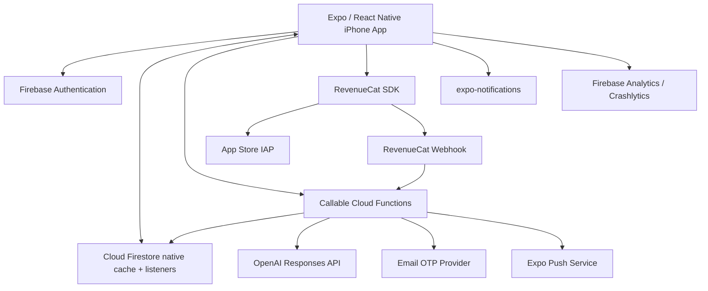

# Soroe 技術スタック評価・選定記録

| 項目 | 内容 |
|---|---|
| 文書バージョン | 1.0 |
| 作成日 | 2026-07-19 |
| ステータス | **提案中 - PoC合格前は本実装へ進まない** |
| 対象 | iPhone MVP、将来Android/Web |
| 関連文書 | `family-checklist-product-design.md` / `soroe-functional-specification.md` / `soroe-implementation-backlog.md` |

## 1. 結論

現時点の第一候補は次の構成とする。ただし、採用確定ではなく、EPIC-00の実機PoCを通過した時点で確定する。

| レイヤー | 第一候補 | 判定 |
|---|---|---|
| Mobile | React Native + Expo Development Build + TypeScript | PoC待ち |
| Navigation | Expo Router | PoC待ち |
| Backend | Firebase / Cloud Firestore Standard / Cloud Functions 2nd gen | PoC待ち |
| Auth | Firebase Auth + Apple + Google + 独自メールOTP | PoC待ち |
| Offline | React Native FirebaseのネイティブFirestore永続キャッシュ | 最重要PoC |
| Subscription | RevenueCat + App Store IAP | PoC待ち |
| AI | Cloud Functions経由のOpenAI Responses API + Structured Outputs | 採用候補 |
| Push | `expo-notifications` + Expo Push Service | 暫定採用 |
| Analytics / Crash | Firebase Analytics / Crashlytics | 採用候補 |
| CI/CD | GitHub Actions + EAS Build/Submit、ローカルビルドを退避経路にする | 採用候補 |

採用理由は「流行しているから」ではない。Soroeで最も実装リスクが高い、リアルタイム共有、オフライン書込、ネイティブ認証、課金、実機配布を、一人で最短に成立させられる可能性が最も高いためである。

## 2. 評価の前提

### 2.1 固定条件

- 1人、週10〜15時間。
- 初回はiPhone、日本市場。
- リアルタイム共有とオフライン編集はMVP必須。
- AndroidはPhase 2、WebはPhase 3として想定する。
- 月間運用費は売上安定まで1万円以内を目標とする。
- React / TypeScriptの既存知識を活用できる前提とする。
- ネイティブコードの保守をゼロにはできないが、独自ネイティブ実装は最小化する。

このうち「React経験がない」「Android/Webを作らない」のどちらかが事実なら、評価結果は変わる。前者ならFlutter、後者ならSwiftUIの順位が上がる。

### 2.2 評価原則

1. 必須要件を追加の同期基盤なしで満たせること。
2. 公式SDKと公式ドキュメントで主要経路を構成できること。
3. ネイティブ依存をDevelopment BuildとRelease Buildの両方で検証できること。
4. 無料枠だけでなく、課金開始後の運用・障害対応まで一人で扱えること。
5. ベンダーロックインは、開発速度との交換条件として明示すること。
6. バージョン番号ではなく、安定版・互換性・撤退条件を固定すること。

## 3. クライアント技術の比較

### 3.1 重み付き評価

5点満点。点数は公式に保証された性能値ではなく、Soroeの条件と「React経験あり」を前提にした選定上の推定である。

| 評価軸 | 重み | React Native + Expo | Flutter | SwiftUI |
|---|---:|---:|---:|---:|
| 一人開発の速度 | 25% | 5 | 3 | 3 |
| Firebase/オフライン適合 | 20% | 5 | 5 | 5 |
| iOS品質・ネイティブ連携 | 15% | 4 | 4 | 5 |
| Android/Webへの再利用 | 15% | 4 | 5 | 1 |
| ライブラリ・採用継続性 | 10% | 4 | 4 | 5 |
| Build/TestFlight運用 | 10% | 5 | 4 | 4 |
| 別構成への移行余地 | 5% | 3 | 3 | 2 |
| **加重結果** | **100%** | **4.50** | **4.05** | **3.65** |

### 3.2 React Native + Expo

**強み**

- React/TypeScriptの既存知識を利用できる。
- React Native公式も、新規アプリではExpoのようなFramework利用を推奨している。
- Expo Router、Development Build、EAS Build/Submitでルーティング、署名、配布の作業を削減できる。
- React Native FirebaseとRevenueCatはExpo Development Buildで利用できる。
- iOS/Androidでドメイン・画面コードを共有しやすい。

**弱み**

- Expo GoではReact Native FirebaseとRevenueCatの本番挙動を検証できない。
- config plugin、CocoaPods、Xcodeの不整合を完全には避けられない。
- ネイティブクラッシュはdevelopment clientだけでは確認できないため、preview/release buildが必要。
- Webは「同じコードがそのまま完成品になる」とは考えず、ドメイン・Schema・デザイントークンの共有を主目的にする。

**採用条件**

- 安定版Expo SDKで、Firestore/Auth/Crashlytics/RevenueCatを含むDevelopment BuildとRelease Buildが作れる。
- ネイティブパッケージへforkや恒常的なpatchを当てずに動く。
- 実機2台のオフライン同期PoCが合格する。

### 3.3 Flutter

**強み**

- iOS、Android、Webを公式サポートし、FlutterFireもAuth、Firestore、Functions、Messaging、Crashlytics等を提供する。
- UI描画の一貫性が高く、Firebaseとの組み合わせは十分に成熟している。
- Expo固有のconfig pluginやSDKリリース周期に依存しない。

**弱み**

- 現在のReact/TypeScript資産を使えず、Dart、Widget、Build周辺の学習が必要。
- Soroeの14〜20週という短いMVPでは、フレームワーク学習が機能開発時間を圧迫する。
- TypeScriptのCloud FunctionsとDartクライアント間で、Schema共有はコード生成または二重管理になる。

**昇格条件**

- Expo PoCがネイティブ依存で2回以上失敗する。
- Expo固有問題の解決見積が追加12時間を超える。
- 開発者がFlutter/DartをReact Nativeと同程度に扱える。

### 3.4 SwiftUI

**強み**

- iOSのUI、アクセシビリティ、StoreKit、Sign in with Appleとの統合が最も直接的。
- Xcodeの診断とApple公式APIだけで多くを完結できる。
- iPhoneだけを長期運用するなら、技術的には最も単純になり得る。

**弱み**

- Android/Webは別実装になる。
- 既存のReact知識を利用できない場合、MVP速度は保証できない。
- 将来3クライアントを一人で保守する構成になりやすい。

**昇格条件**

- Android/Webを少なくとも2年間は作らないと決定する。
- iOS固有体験を、開発速度より明確に優先する。

## 4. データ・バックエンドの比較

### 4.1 重み付き評価

| 評価軸 | 重み | Firebase | Supabase単体 | Supabase + 外部同期 | AWS AppSync系 | 独自API + PostgreSQL |
|---|---:|---:|---:|---:|---:|---:|
| モバイルのオフライン同期 | 30% | 5 | 2 | 5 | 3 | 1 |
| リアルタイム共有 | 15% | 5 | 4 | 5 | 5 | 3 |
| Auth/Rules/Functions統合 | 15% | 5 | 4 | 4 | 4 | 4 |
| 一人での運用負荷 | 15% | 5 | 4 | 2 | 2 | 1 |
| 初期コスト予測 | 10% | 4 | 3 | 2 | 2 | 2 |
| SQL・移植性 | 10% | 2 | 5 | 5 | 3 | 5 |
| React Native成熟度 | 5% | 5 | 4 | 3 | 3 | 3 |
| **加重結果** | **100%** | **4.60** | **3.40** | **4.00** | **3.20** | **2.35** |

### 4.2 Firebaseを第一候補にする理由

- Apple/Android SDKはオフラインの読取、書込、購読、復帰後同期を標準提供する。
- 別項目を別documentにすれば、家族の同時操作が衝突しにくい。
- Auth、App Check、Security Rules、Functions、Messaging、Analytics、Crashlyticsを同じ運用面で扱える。
- EmulatorでAuth、Firestore、Functions、Rulesのテストを組みやすい。
- 初期無料枠があり、読み書き数の計測とBudget Alertで月1万円の上限を管理できる。

**許容する欠点**

- 同じdocumentの競合はLast Write Winsであり、CRDTではない。
- 複雑な横断検索・集計・管理画面には向きにくい。
- 読取回数課金なので、listenerの範囲と再接続を計測する必要がある。
- Firestore固有のデータモデルとSecurity Rulesへロックインする。

### 4.3 Supabaseを初期採用しない理由

SupabaseはPostgreSQL、RLS、Auth、Realtimeという強い構成で、将来の集計・検索・管理画面には魅力がある。一方、Soroe必須のモバイルオフライン同期は、Supabase単体ではFirestoreと同じ形で完結しない。WatermelonDBの独自同期、PowerSync等の追加サービス、競合処理を導入すると、初期MVPの運用面が増える。

次の場合は再評価する。

- 高度な検索・集計・UGCテンプレートが主要機能になる。
- Firestoreの読取費またはQuery制約が、実測で事業上の問題になる。
- オフライン同期サービスを追加しても採算と運用が成立する。

### 4.4 AWS AppSync系を初期採用しない理由

AppSyncはリアルタイムGraphQLとして強力だが、Amplify DataStoreの既存ドキュメントはGen 1からの移行を案内しており、新規MVPで「低設定のオフライン同期基盤」として選ぶ確実性が低い。IAM、GraphQL schema、resolver、監視、複数サービスの理解も必要になるため、一人開発の初期構成には重い。

### 4.5 独自Laravel/AWS APIを初期採用しない理由

通常のオンラインCRUDは実装できるが、ローカルDB、変更キュー、再送、競合、購読、端末認証を自前で構成する必要がある。これはSoroeの差別化ではなく基盤作業であり、週10〜15時間のMVP条件と合わない。

## 5. 推奨アーキテクチャ

### 5.1 クライアントから直接書く処理

オフライン動作が必要で、Security Rulesだけで権限を判定できる処理に限定する。

- 項目の追加、編集、チェック、再開、論理削除。
- リスト名、色、アイコン等の基本情報変更。
- ユーザー本人の通知表示設定など、他ユーザーの権利を変更しない設定。

### 5.2 Cloud Functionsを必須にする処理

上限、課金、所有権、回数を原子的に判定する処理はサーバーを正とする。

- リスト作成、複製、アーカイブ解除。
- 招待発行、招待承認、所有権移譲。
- マイテンプレート保存。
- AI回数予約、生成、回数返却、結果からのリスト保存。
- RevenueCat webhookとEntitlement更新。
- アカウント削除。

理由は、Firestoreのclient transactionがオフラインでは失敗し、Free上限やEntitlementをクライアント申告へ任せられないためである。項目編集のオフライン対応と、権利変更のオンライン必須を分ける。

## 6. 個別技術の選定

| 領域 | 採用案 | 採用しない/延期する案 | 理由 |
|---|---|---|---|
| Expo version | PoC時点の最新**安定版**をlockfileで固定 | Canary/Beta、設計書への固定番号 | リリース時期とネイティブSDK互換性を優先 |
| Native generation | Expo config plugin + CNG | native folderの常時手編集 | 差分とupgrade負荷を抑える |
| Repository | pnpm workspace: mobile/functions/sharedの3単位 | 6個以上の細分化package | EAS monorepo複雑性を抑え、Schemaだけ共有 |
| UI | React Native primitives + Soroe tokens | 大型UI kit | デザイン再現と依存削減 |
| Long list | まずFlatList | FlashListの先行導入 | AI最大80件なら、profiling前の最適化は不要 |
| Local state | hooks/useReducer、必要箇所だけZustand | Redux、全server stateのstore複製 | Firestore listenerを正とし二重状態を避ける |
| Form | React Hook Form + Zod | 独自validation | 入力とSchemaを一元化 |
| Server state | Firestore listener + Repository | TanStack Queryとの二重cache | Firestoreのoffline metadataを失わない |
| Functions | Firebase Functions 2nd gen / TypeScript | 常設Laravel API | 認証、Emulator、Firestoreとの統合 |
| Deep Link | 自前ドメインのUniversal Links / App Links | Firebase Dynamic Links | Dynamic Linksは2025-08-25に終了済み |
| Email OTP | Provider interface + Resend等をdeliverability PoCで決定 | provider SDKのdomain層直結 | 送達率と乗換可能性を維持 |
| Push | Expo Push ServiceをMVP暫定採用、native tokenも保持 | 初日からAPNs/FCMを個別実装 | 無料・実装が小さい。SLAなしを許容しexitを残す |
| Subscription | RevenueCat core SDK + Soroe独自Paywall | StoreKit 2直実装、Remote Paywall UI依存 | 状態・復元・将来Androidを短時間で統一 |
| AI | Responses API + Structured Outputs、server only | モバイルから直接API、model ID直書き | 秘密、回数、Schema、モデル変更をserver管理 |
| Analytics | Firebase Analytics | PostHog等の追加 | 初期ファネルには十分で運用サービスを増やさない |
| Crash | Firebase Crashlytics | Sentry同時導入 | 初期は1系統。JS診断不足が実測されたらSentry再評価 |
| Unit/UI test | Vitest（shared/functions）+ Jest/RNTL（mobile） | 1 runnerへの無理な統一 | React Native変換とNode testを各標準へ寄せる |
| E2E | Maestro + 2端末手動シナリオ | Detoxの先行導入 | MVPの導入・保守コストを抑える |
| Build | EAS Free + local Release Build fallback | EASだけに依存 | 無料枠を使い、障害時にXcodeから出せる状態を保つ |
| OTA Update | 初回リリース後に再評価 | MVP初日からEAS Update | native runtime差分と審査運用を先に増やさない |

## 7. AI実装方針

- APIはResponses APIを使い、出力をJSON Schemaへ固定する。
- モデル名をアプリへ含めず、Functions側の設定値にする。
- 「Freeは安価、Premiumは高品質」と先にモデル名を固定しない。50ケース評価で品質、遅延、1生成あたり原価を測って決める。
- 評価時点で利用可能なモデルだけを候補にし、preview限定モデルをMVPの必須依存にしない。
- model aliasでは挙動が変わり得るため、リリース判定用評価ではsnapshotを記録する。
- 失敗、安全拒否、形式不正の回数返却は、requestIdによる状態機械で管理する。
- 登山、防災、医療周辺は、生成モデルだけに安全判断を任せず、固定注意文、禁止ルール、評価ケースを併用する。

OpenAI Developer Docs専用連携はこの検討時にCodexへ追加済み。現在のタスクでは再起動前のため公式Web資料を使用し、次回以降はDocs連携を優先する。

## 8. 技術選定PoC

### STACK-GATE-01 — 19時間以内

このゲートは `soroe-implementation-backlog.md` のEPIC-00と同じ作業枠で実施し、追加工数にはしない。

| PoC | 上限 | 合格条件 |
|---|---:|---|
| Expo native build | 5h | 最新安定版でRNFirebaseとRevenueCatをlinkし、Development/Preview buildが実機起動する |
| Firestore 2端末同期 | 6h | Aの追加がBへ反映し、Bの機内モード追加が再起動後も残り、復帰後Aへ同期する |
| 競合・削除 | 2h | 別項目は統合、同じ項目はLWWを観測、soft delete方針で復元不能な破損がない |
| Auth/Deep Link smoke | 2h | Firebase Auth sessionと自前Universal Linkからアプリ内routeへ到達する |
| RevenueCat smoke | 2h | Sandbox Offeringを取得し、SDK identityをFirebase uidへ結び付けられる |
| ADR更新・判定 | 2h | 実測時間、失敗、native変更、月額見積を記録して採否を確定する |

### 合格条件

- 恒常的なpatch-package、fork、手作業のnative差分がない。
- PoCで作ったRelease相当buildがクラッシュせず起動する。
- オフライン変更がアプリ再起動をまたいで消えない。
- 同期結果が2端末で収束する。
- 既知の問題に回避策、追加工数、撤退条件が記録される。

### 不合格時

1. 原因がExpo固有か、Firebase data modelか、設定ミスかを切り分ける。
2. Expo固有問題の解決に追加12時間以上かかる場合、Flutter + FlutterFireで6時間の比較PoCを行う。
3. Android/Webを撤回できる場合だけ、SwiftUI + Firebaseを再評価する。
4. Firebaseの同期モデルが要件を満たさない場合、Supabase + PowerSyncを次候補にする。

## 9. コスト管理

### 9.1 初期の想定

- EAS Freeは月15回のiOS buildを含み、ローカルbuildも可能。
- Firestoreには日次無料枠があるが、Functions deployにはBlaze planが必要。
- RevenueCatは月間追跡売上2,500 USDまで無料、その後1%。
- Expo Push Serviceは無料だがSLAはなく、600通知/秒の上限がある。
- 変動費の中心はOpenAI、メール送信、Firestore read、Functions、外向き通信になる。

### 9.2 必須ガードレール

- Google Cloudの月次Budget Alertを3,000円、6,000円、9,000円で設定する。
- Firestore read/write、listener再接続、AI入出力token、メール送信数を日次集計する。
- 一覧画面では全リストの全項目を購読せず、一覧用documentだけを購読する。
- 詳細画面を離れたらitem listenerを解除する。
- AIは1生成の入力/出力上限と30秒timeoutを設定する。
- OpenAI、メール、通知の障害でリストCRUDを巻き込まない。

## 10. 撤退・再評価条件

| 条件 | 対応 |
|---|---|
| Expo/RNFirebase upgradeで2回連続してRelease Build不能 | Flutter比較PoC |
| Firestore費が売上の5%を継続して超える | listener/非正規化改善後、Supabase等を比較 |
| 複雑な検索・UGC管理が主要開発の30%以上になる | PostgreSQL read modelまたはbackend再検討 |
| Expo Pushの障害・不足が通知失敗の主要因になる | native tokenを使いFCM/APNs directへ移行 |
| CrashlyticsでJS障害の原因特定が困難 | Sentryを比較導入 |
| RevenueCat費より自前運用の期待削減額が十分大きくなる | StoreKit/Play Billing内製を再試算 |
| Android/Web計画を撤回 | SwiftUIの総保守費を再比較 |

## 11. 現行設計書から修正する点

1. 「Expo SDK 57系」のような固定はやめ、PoC時点の最新安定版をlockfileへ固定する。
2. `FlashList` は初期依存から外し、FlatListの実機profile後に判断する。
3. Zustandはアプリ全体の標準にせず、複数画面draft等の必要箇所だけにする。
4. リスト作成・復元・招待受諾・テンプレート保存は、上限判定のためFunctions経由にする。
5. Firebase Dynamic Linksを使用せず、自前ドメインのUniversal Links/App Linksを使う。
6. リポジトリpackageは `mobile`、`functions`、`shared` から始め、domain/i18n/tokensの別package化を急がない。
7. AIモデル名は設計書の例示に留め、評価結果と利用可能性でserver設定する。
8. EAS Updateは初回App Store公開後に判断する。

## 12. 参照した一次資料

- [React Native: new apps should use a framework such as Expo](https://reactnative.dev/docs/next/environment-setup)
- [Expo: Using Firebase](https://docs.expo.dev/guides/using-firebase/)
- [React Native Firebase: Expo requires a development build](https://rnfirebase.io/)
- [Flutter: Supported deployment platforms](https://docs.flutter.dev/reference/supported-platforms)
- [Firebase for Flutter setup](https://firebase.google.com/docs/flutter/setup)
- [Apple: SwiftUI](https://developer.apple.com/swiftui/)
- [Firestore: Offline persistence and Last Write Wins](https://firebase.google.com/docs/firestore/manage-data/enable-offline)
- [Firestore: Transactions fail offline](https://firebase.google.com/docs/firestore/manage-data/transactions)
- [Firebase: Firestore billing](https://firebase.google.com/docs/firestore/pricing)
- [Firebase: Callable Functions include Auth and App Check tokens](https://firebase.google.com/docs/functions/callable)
- [Firebase: Custom authentication tokens](https://firebase.google.com/docs/auth/admin/create-custom-tokens)
- [Firebase Dynamic Links shutdown FAQ](https://firebase.google.com/support/dynamic-links-faq)
- [Supabase React Native quickstart](https://supabase.com/docs/guides/getting-started/quickstarts/expo-react-native)
- [Supabase offline-first example](https://supabase.com/blog/react-native-offline-first-watermelon-db)
- [AWS Amplify: Migrate from DataStore](https://docs.amplify.aws/gen1/react-native/build-a-backend/more-features/datastore/migrate-from-datastore/)
- [RevenueCat: Expo installation](https://www.revenuecat.com/docs/getting-started/installation/expo)
- [RevenueCat pricing](https://www.revenuecat.com/pricing/)
- [Apple: StoreKit 2](https://developer.apple.com/storekit/)
- [Expo Push Service](https://docs.expo.dev/push-notifications/sending-notifications/)
- [Expo: EAS Build and local build support](https://docs.expo.dev/build)
- [Expo pricing](https://expo.dev/pricing)
- [OpenAI API: Models](https://developers.openai.com/api/docs/models)

